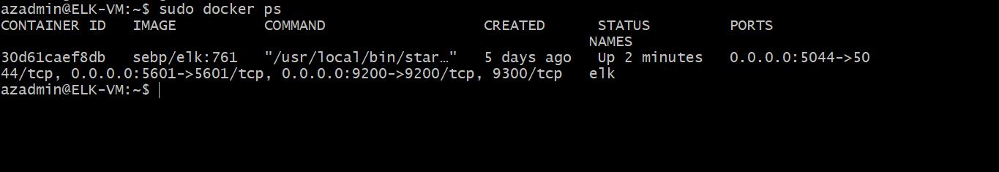
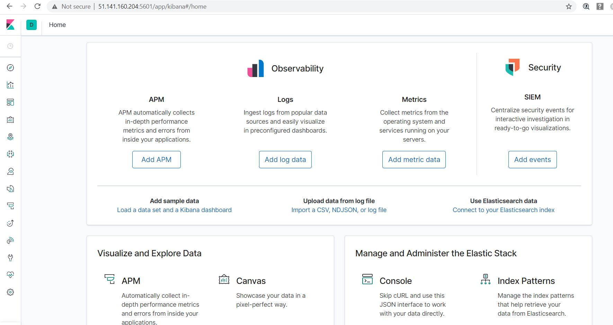
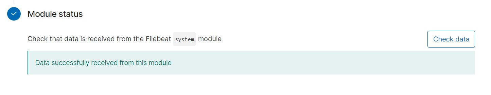
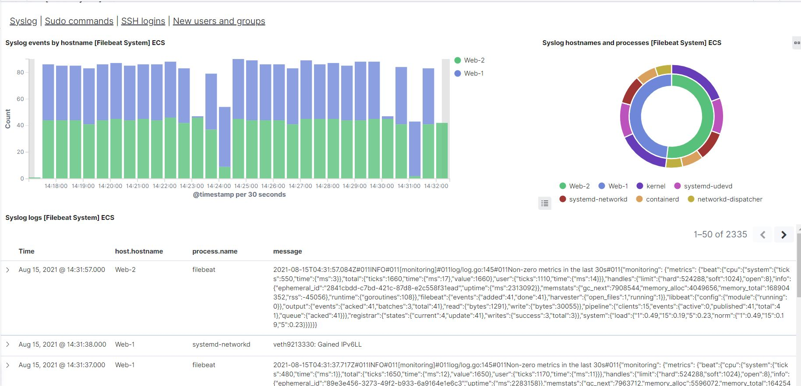

# ELK-Stack-Project
Designing and implementing an ELK Stack to collect logs ,synthesize complex searches and create visualization on the network data

## Automated ELK Stack Deployment

The files in this repository were used to configure the network depicted below.

These files have been tested and used to generate a live ELK deployment on Azure. They can be used to either recreate the entire deployment pictured above. Alternatively, select portions of the #playbook file may be used to install only certain pieces of it, such as Filebeat.

 - File Beat Playbook [Link](Ansible/filebeat-playbook.yml)
 - Install ELK Playbook [Link](Ansible/install-elk.yml)

This document contains the following details:
- Description of the Topologu
- Access Policies
- ELK Configuration
  - Beats in Use
  - Machines Being Monitored
- How to Use the Ansible Build

### Description of the Topology

The main purpose of this network is to expose a load-balanced and monitored instance of DVWA, the D*mn Vulnerable Web Application.

Load balancing ensures that the application will be highly available, in addition to restricting ssh traffic to the network.
- What aspect of security do load balancers protect? 

-- A load balancer can add additional layers of security to your website without any changes to your application.
	--Protect applications from emerging threats
	The Web Application Firewall (WAF) in the load balancer protects your website from hackers and includes daily rule updates just like a virus scanner
	--Authenticate User Access
The load balancer can request a username and password before granting access to your website to protect against unauthorized access
	--Protect against DDoS attack
The load balancer can detect and drop distributed denial-of-service (DDoS) traffic before it gets to your website

- What is the advantage of a jump box?
--A jump box provides controlles access across multiple devices over different security groups.It is the first point of secure contact before any admibistrative task in initiated or connecting other networks.

Integrating an ELK server allows users to easily monitor the vulnerable VMs for changes to the Jumpbox and system network.

- What does Filebeat watch for?
--Filebeat monitors the log files or locations that you specify, collects log events, and forwards them either to Elasticsearch or Logstash for indexing.

- What does Metricbeat record?
--Metricbeat takes the metrics and statistics that it collects and ships them to the output that you specify, such as Elasticsearch or Logstash.

The configuration details of each machine may be found below.

| Name     | Function     | IP Address | Operating System |
|----------|----------    |------------|------------------|
| Jump Box | Gateway      | 10.0.0.1   | Linux            |
| Web-1    | Web Server 1 | 10.0.0.7   | Linux            |
| Web-2    | Web Server 2 | 10.0.0.8   | Linux            |
| ELK_VM   | ELK Server   | 10.1.0.6   | Linux            |

### Access Policies

The machines on the internal network are not exposed to the public Internet. 

Only the JumpBox Virtual machine can accept connections from the Internet. Access to this machine is only allowed from the following IP addresses:
- Personal public IP

Machines within the network can only be accessed by Jump Box.

- Which machine did you allow to access your ELK VM? What was its IP address?
--Jump Box/Ansible Container
--Private IP: 10.0.0.4
--Public IP: 20.102.51.89

A summary of the access policies in place can be found in the table below.

| Name     | Publicly Accessible | Allowed IP Addresses |
|----------|---------------------|----------------------|
| Jump Box | Yes                 |  Personal public IP  |
| Web-1    | No                  |  10.0.0.4            |
| Web-2    | No                  |  10.0.0.4            |
| ELK_VM   |Yes Kibana Port:5601 |  52.183.12.120       |
| ELK_VM   |Yes Http Port:80     |  20.51.253.70 (LP_IP)|

### Elk Configuration

Ansible was used to automate configuration of the ELK machine. No configuration was performed manually, which is advantageous because...It can complete various tasks over different networks using playbooks .Time per machine is significantly reduced.

- What is the main advantage of automating configuration with Ansible?
We can manage multi-tier deployments very easily using Ansible.

The playbook implements the following tasks:
- _ In 3-5 bullets, explain the steps of the ELK installation play. E.g., install Docker; download image; etc._

The playbook has the following tasks:
- ...Install Docker.io - The Docker engine, used for running containers
- ...Install python-pip3 - it's a tool that allows you to install and manage additional libraries and dependencies that are not distributed as part of the standard library.
- ...Increase virtual memory
- ...Use sysctl to use more memory -`sysctl` module aso that this setting is automatically run if your VM has been restarted
- ...Download and launch an elk container, while listing the ports it will run on .`sebp` is the organization that made the container. `elk` is the container and `761` is the version.
Configures the container to start with the following port mappings:
			- `5601:5601`
			- `9200:9200`
			- `5044:5044`

The following screenshot displays the result of running `docker ps` after successfully configuring the ELK instance.

### Target Machines & Beats
This ELK server is configured to monitor the following machines:

| Name     | Function     | IP Address | 
|----------|----------    |------------|
| Web-1    | Web Server 1 | 10.0.0.7   |
| Web-2    | Web Server 2 | 10.0.0.8   | 

We have installed the following Beats on these machines:
- _Filebeat

These Beats allow us to collect the following information from each machine:
- Filebeat will collects and monitors all log files or specific locations that are specified

### Using the Playbook
In order to use the playbook, you will need to have an Ansible control node already configured. Assuming you have such a control node provisioned: 

SSH into the control node and follow the steps below:
- Copy the filebeat-config.yml file to /etc/ansible/files/filebeat-config.yml.

- Update the filebeat-config.yml file to include...
  output.elasticsearch:
  hosts: ["10.1.0.4:9200"]

  setup.kibana:
  host: "10.1.0.4:5601"

- Run the playbook, and navigate to http://[your.VM.IP]:5601/app/kibana to check that the installation worked as expected.

_ Answer the following questions to fill in the blanks:_

- _Which file is the playbook? Where do you copy it?
The playbook file is filebeat-playbook.yml [Link](Ansible/filebeat-playbook.yml). Its location is /etc/ansible

- _Which file do you update to make Ansible run the playbook on a specific machine? How do I specify which machine to install the ELK server on versus which to install Filebeat on?_

Host file is updated so Ansible run the playbook on a specific machine.

[webservers]
10.0.0.7 ansible_python_interpreter=/usr/bin/python3
10.0.0.8 ansible_python_interpreter=/usr/bin/python3

[elk]
10.1.0.6 ansible_python_interpreter=/usr/bin/python3

- _Which URL do you navigate to in order to check that the ELK server is running?
http://[your.VM.IP]:5601/app/kibana

_As a **Bonus**, provide the specific commands the user will need to run to download the playbook, update the files, etc._

	- Run: `curl -o
